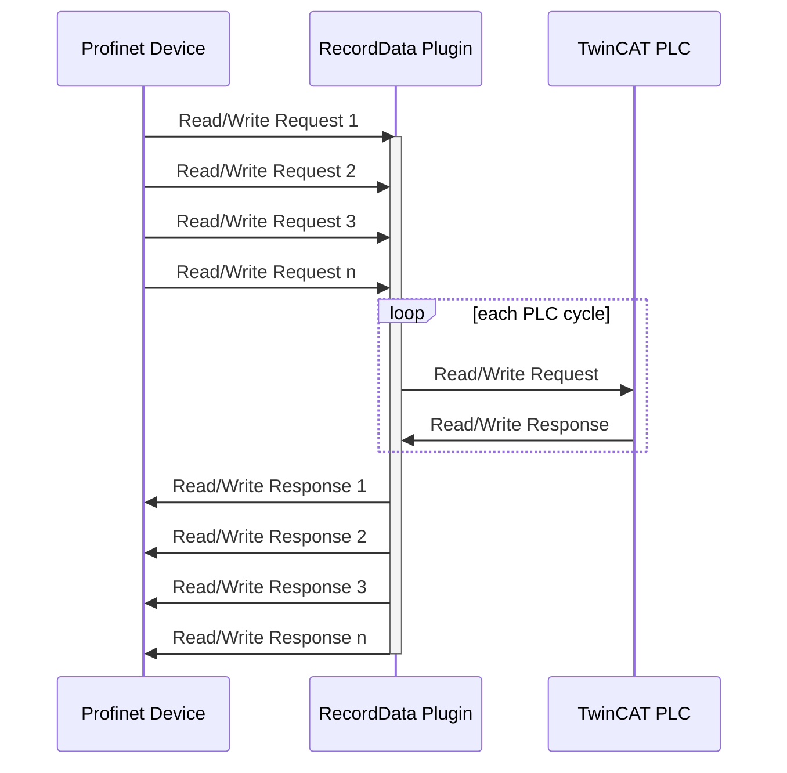

# OC.Assistant.Twincat

Supports TwinCAT workflows for Open Commissioning.

TwinCAT can be used to act as a co-simulation for simulating behaviour models in realtime and making
device data available for the Unity project.
This workflow is mainly used when working with hardware-in-the-loop (HiL) simulations.

## Requirements
- ``TwinCAT 3.1.4024.x`` or newer

Supported Visual Studio Versions:
- ``TwinCAT Shell based on Visual Studio 2017`` (comes with TwinCAT v3.1.4024.x)
- ``TwinCAT Shell based on Visual Studio 2022`` (comes with TwinCAT v3.1.4026.x)
- ``Visual Studio 2017``
- ``Visual Studio 2019``
- ``Visual Studio 2022``

## Core Functionality
- Generating and updating connected TwinCAT projects
- Making plugin data available to the TwinCAT project
- Scanning for Profinet devices and creating corresponding Profinet device nodes
- Scanning EtherCAT Simulation nodes and creating corresponding variables

## The `Twincat` menu
The menu contains functions to update the connected TwinCAT project.
This menu is only active when the Assistant is connected to a TwinCAT solution.

- __Update Project__

  Updates the TwinCAT project based on the current [configuration](#configuration-file).


- __Update Task__

  Generates Task variables based on the devices of the PLC project.
  The PLC project needs to be build successfully before updating the task.


- __Create device template__

  Creates a device template in the TwinCAT project with the specified name.
  The template contains a Function Block and structures and can be used to quickly create new devices.


- __Profinet Scanner__

  Starts the [Profinet Scanner](#profinet-scanner) tool.


- __Settings__

  The Settings for the connected TwinCAT solution
  - __PlcName__ specifies the name of the co-simulation PLC project 
  - __PlcTaskName__ specifies the name of the Task in which the variables should be generated

### Profinet Scanner

Captures Profinet protocols on a network interface to create devices for a Profinet emulation.
The tool has to be installed first by clicking __Install__ in the __Profinet Scanner__ menu.
After installation, __Open__ becomes available.

To scan for Profinet devices:

1. Click __Open__
2. Enter a name for the TwinCAT Profinet Node
3. Select the network adapter (TwinCAT Real-Time driver is required)
4. Specify a TIA *.aml export file
5. Click __OK__ to start

## TcAdsChannel
`OC.Assistant.Twincat` also implements a communication channel ``TcAdsChannel`` for all plugin instances.
When connected to a TwinCAT solution, a plugin can connect to TwinCAT instead of Unity via this channel.
In this scenario, the TwinCAT project acts as the co-simulation for simulating behaviour models in realtime and making
device data available for the Unity project.

## Configuration File

The `OC.Assistant.xml` file is created when connecting to a TwinCAT solution and serves as the base 
for generating objects in the TwinCAT solution.

The project hierarchy `Main` is defined by Unity and generates the PLC co-simulation project.

This is an example configuration:
```xml
<?xml version="1.0" encoding="utf-8"?>
<Config>
  <Twincat>
    <Settings>
      <PlcProjectName>OC</PlcProjectName>
      <PlcTaskName>PlcTask</PlcTaskName>
    </Settings>
    <Main>
      <Group Name="Devices">
        <Group Name="Cylinders">
          <!-- This is a device with direct assignment -->
          <Device Name="Cylinder_1" Type="FB_Cylinder" >
            <Label>++ST001+FG001-CYL001</Label>
            <Control Name="bRetract" Assignment="PLC1.Q0.0" />
            <Control Name="bExtend" Assignment="PLC1.Q0.1" />
            <Status Name="bRetracted" Assignment="PLC1.I0.0" />
            <Status Name="bExtended" Assignment="PLC1.I0.1" />
          </Device>
          <Device Name="Cylinder_2" Type="FB_Cylinder" />
          <Device Name="Cylinder_3" Type="FB_Cylinder" />
          <Device Name="Cylinder_4" Type="FB_Cylinder" />
        </Group>
        <Group Name="Drives">
          <!-- This is a device with address assignment -->
          <Device Name="Drive_Position" Type="FB_Drive" >
            <Label>++ST001+FG001-DRV001</Label>
            <Address Name="pControl" Assignment="PLC1.Q2" />
            <Address Name="pStatus" Assignment="PLC1.I2" />
          </Device>
          <Device Name="Drive_Simple" Type="FB_Drive" />
          <Device Name="Drive_Speed" Type="FB_Drive" />
        </Group>
        <Group Name="Interactions">
          <Device Name="Button" Type="FB_Button" />
          <Device Name="Lamp" Type="FB_Lamp" />
          <Device Name="Lock" Type="FB_Lock" />
          <Device Name="Panel_1" Type="FB_Panel" />
          <Device Name="Toggle" Type="FB_Button" />
        </Group>
        <Group Name="SensorsAnalog">
          <Device Name="SensorAnalog_1" Type="FB_SensorAnalog" />
          <Device Name="SensorAnalog_2" Type="FB_SensorAnalog" />
          <Device Name="SensorAnalog_3" Type="FB_SensorAnalog" />
        </Group>
        <Group Name="SensorsBinary">
          <Device Name="SensorBinary_1" Type="FB_SensorBinary" />
          <Device Name="SensorBinary_2" Type="FB_SensorBinary" />
          <Device Name="SensorBinary_3" Type="FB_SensorBinary" />
        </Group>
      </Group>
    </Main>
  </Twincat>
</Config>
```

## RecordDataServer

`OC.Assistant.Twincat` also implements a `RecordDataServer` that can be used to send and receice Profinet acyclic data 
(RecordData) when connecting a virtual model to a Profinet PLC (Hardware-in-the-loop).

### Usage
- In the Assistant, add a new plugin instance using the `+` button 
- Select `RecordDataServer`, configure parameters and press `Apply`
- The plugin starts when TwinCAT goes to Run Mode

### Plugin Parameters
- __AutoStart__: Automatic start and stop with TwinCAT
- __Port__: The ADS port of the Profinet Device. Default port is 852.

### How it works
The RecordData Plugin serves as a buffer to store Read/Write Requests (RDREC/WRREC) and Read/Write Responses.
Behaviour models within the TwinCAT PLC can access the Read/Write Requests and send corresponding Read/Write Responses.

